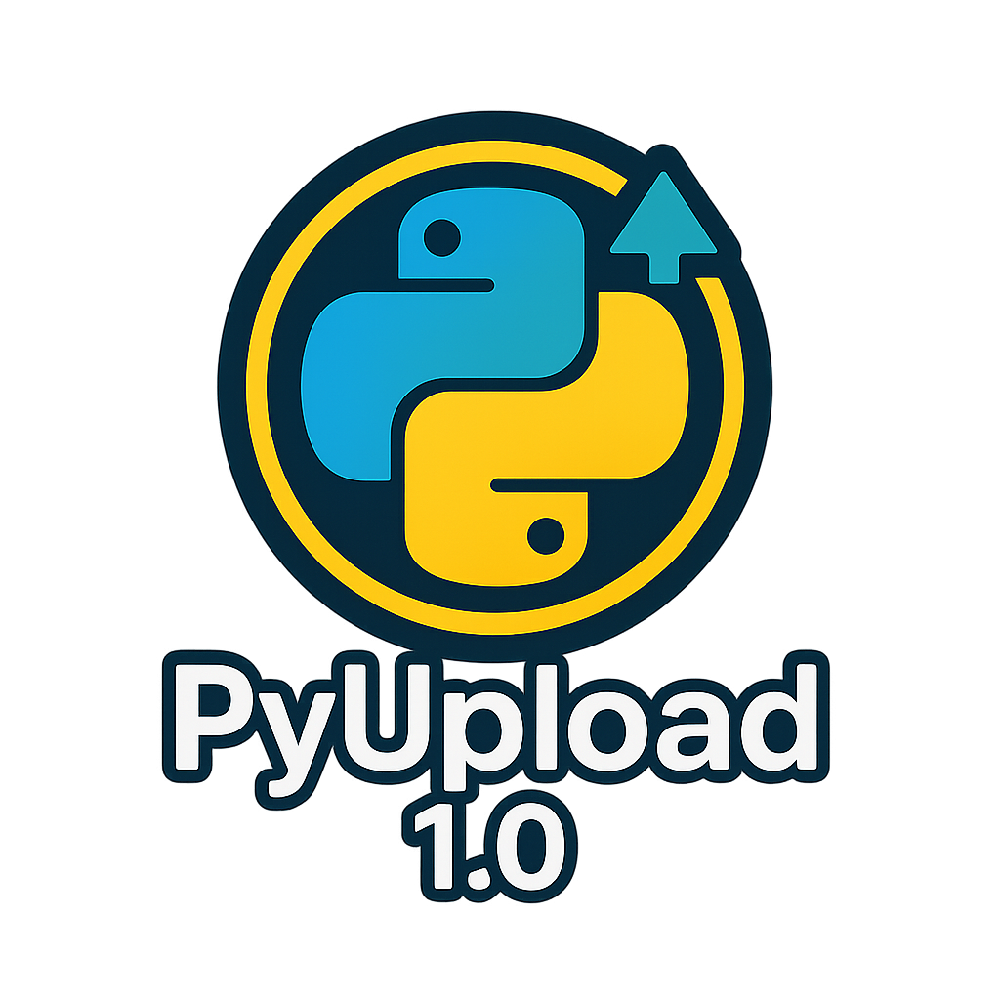

# pyUpload (TKInter Version)



## ⚠️ Projektstatus: Eingefroren – Nur noch Bugfixes  

Diese Version von **pyUpload** wird **nicht weiterentwickelt** und erhält nur noch Fehlerbehebungen.  
Die neue Version mit Flask-Backend ist **BALD** verfügbar unter:  

🔗 **<https://github.com/realAscot/pyUpload2>**

---

- [pyUpload (TKInter Version)](#pyupload-tkinter-version)
  - [⚠️ Projektstatus: Eingefroren – Nur noch Bugfixes](#️-projektstatus-eingefroren--nur-noch-bugfixes)
  - [pyUpload – Sicherer Datei-Upload-Server über HTTPS (lokal \& offline)](#pyupload--sicherer-datei-upload-server-über-https-lokal--offline)
  - [🛠 Features](#-features)
  - [🚀 Schnellstart](#-schnellstart)
    - [▶️ Für Windows:](#️-für-windows)
    - [🐧 Für Linux / macOS:](#-für-linux--macos)
  - [🧩 Kommandozeilenoptionen](#-kommandozeilenoptionen)
  - [🌐 Zugriff im Browser](#-zugriff-im-browser)
  - [📁 Logs \& Uploads](#-logs--uploads)
  - [🔐 Hinweis zur SSL-Zertifikatswarnung](#-hinweis-zur-ssl-zertifikatswarnung)
  - [💡 Ideen für zukünftige Entwicklungen](#-ideen-für-zukünftige-entwicklungen)
  - [🐛 Bekannte Bugs](#-bekannte-bugs)
  - [👨‍💻 Autor und alle beteiligte](#-autor-und-alle-beteiligte)
  - [📝 Lizenz](#-lizenz)

---

## pyUpload – Sicherer Datei-Upload-Server über HTTPS (lokal & offline)  

Diese Version basiert auf **Tkinter (GUI + QR)** sowie einer optionalen **reinen CLI-Nutzung**.  
Sie ist vollständig lokal lauffähig – ganz ohne Installation von externen Tools oder komplexen Abhängigkeiten.

---

## 🛠 Features

- **HTTPS-gesicherter Datei-Upload**
- **Selbstsigniertes SSL-Zertifikat bei Bedarf**
- **QR-Code-basierte Verbindung für Smartphones**
- **Client-spezifische Verzeichnisse und Logs**
- **GUI und Konsolen-Modus verfügbar**
- **automatische Einrichtung von `.venv` und Abhängigkeiten**
- **kein Installationsskript mehr nötig – alles passiert beim Start von `main.py`**

---

## 🚀 Schnellstart  

### ▶️ Für Windows:

1. Lade das Projekt herunter oder klone es:  

   ```sh

   git clone https://github.com/realAscot/pyUpload
   ```

   Alternativ einfach eine bereinigte `.zip` bei den [Releases auf GitHub](https://github.com/realAscot/pyUpload/releases/) herrunterladen.
   Diese enthällt kein `.git Archiv` und enthält nur das aller nötigste zum Betrieb des Programms.  

2. Starte die App mit:  

   ```cmd
   start.cmd
   ```

   Alternativ in PowerShell:  

   ```powershell
   cmd /c start.cmd
   ```

   ⚠️ **Alternative 2 falls die Ausführung per Doppelklick auf .bat oder .cmd gesperrt ist:**  

   > Doppelklick auf -> `start.pyw`  

   Es ist möglich das beim ersten mal gefragt wird womit das Programm gestartet werden soll.
   Einfach die Python-Installation suchen und `python.exe` wählen.  
   
   Ich empfehle einfach eine Verknüpfung der `start.pyw` zB auf den Desktop oder ins Startmenü zu legen.  

### 🐧 Für Linux / macOS:

1. Stelle sicher, dass Python 3.8+ installiert ist:

   ```bash
   python3 --version
   ```

2. Mache das Startscript ausführbar:

   ```bash
   chmod +x start.sh
   ```

3. Starte die App:

   ```bash
   ./start.sh
   ```

---

Beim ersten Start wird automatisch:

- eine virtuelle Umgebung `.venv/` im `app/`-Verzeichnis erzeugt
- `requirements.txt` installiert
- das Programm danach neu aus der Umgebung gestartet

---

## 🧩 Kommandozeilenoptionen

Du musst Dich im Verzeichnis `./app` befinden:  

```cmd

python main.py -h oder --h  # Hilfe
python main.py --nogui      # Start ohne GUI / QR
python main.py --port 9999  # Custom-Port verwenden
```

oder für Verknüpfungen die `start.pyw` verwenden:  

```cmd

pythonw.exe start.pyw -h oder --h   # Hilfe
pythonw.exe start.pyw --nogui       # Start ohne GUI / QR
pythonw.exe start.pyw --port 9999   # Custom-Port verwenden
```

Wenn Du die Dateierweiterung `.pyw` mit `pythonw.exe` verknüpfst, klappt es auch ohne mit Doppelklick im Explorer :-)

---

## 🌐 Zugriff im Browser

Sobald gestartet:

```https
https://<lokale-IP>:4443 (oder Port, der mit der option `--port` gestartet wurde)
```

Alternativ QR-Code scannen (GUI-Modus).  
Dateien werden im `upload/<Client-IP>/` gespeichert.

Wichtig dabei ist es darauf zu achten, das tatsächlich auch https verwendet wird, falls man die Adresse händisch eingibt statt mit QR-Code! Man könnte noch zusätzlich einen http-server in der App laufen lassen, der dann automatisch umleitet, aber wir möchten das Programm so klein wie möglich halten.

---

## 📁 Logs & Uploads

- **Uploads**: im Ordner `upload/` nach Client-IP  
- **Zentrale Logs**: `logs/pyupload.log`  
- **Pro-Client Logs**: `logs/<Client-IP>.log`  

---

## 🔐 Hinweis zur SSL-Zertifikatswarnung

⚠️ Beim ersten Aufruf im Browser erscheint möglicherweise eine Warnung wegen eines selbstsignierten SSL-Zertifikats. Das ist normal.  

- Über **„Erweitert“ > „Trotzdem fortfahren“** den Zugriff manuell freigeben  
- Eigene Zertifikate in den Dateien `cert.pem` und `key.pem` hinterlegen  

Damit dein Browser diese Warnung dauerhaft vermeidet, müssen die Zertifikate zu deiner verwendeten Domain passen.
Da das in lokalen oder testnahen Umgebungen in der Regel nicht der Fall ist, lässt sich diese Warnung meist nicht vermeiden.  

>💡 **Wichtig zu wissen:**  
   Die Verbindung ist trotzdem Ende-zu-Ende verschlüsselt. Die Schlüssel werden bei jedem Start lokal neu generiert – direkt auf deinem Rechner.
   Technisch ist die Verbindung also sicher. Dein Browser vertraut dem Zertifikat nur nicht, weil es nicht von einer offiziellen Zertifizierungsstelle stammt – sondern von dir selbst.  

---

## 💡 Ideen für zukünftige Entwicklungen

Hier sind einige Vorschläge für zukünftige Erweiterungen.
Dies ist eine offene Liste von Ideen für zukünftige Features oder Verbesserungen.
Beiträge willkommen!

- [ ] Link zum Server auf der GUI zum Testen klickbar.  
- [ ] _____________________________________________________  
- [ ] _____________________________________________________  

---

## 🐛 Bekannte Bugs

- **Frontend:** wenn im Browser der Button Hochladen gewählt wird, OHNE das Dateien ausgewählt wurden,
  kommt es zu einem *Error response - Error code: 400* im Browser. Lösungsansatz wäre den Button über JS zu sperren solange keine Datei ausgewählt ist. Lässt sich schnell im [template](./app/template.html) erledigen.

Wenn jemand Lust und Zeit hat sich diesem anzunehmen, nur zu. Ich Danke im Vorraus!

---

## 👨‍💻 Autor und alle beteiligte

- **Adam Skotarczak**  
  Kontakt: [adam@skotarczak.net](mailto:adam@skotarczak.net)  
  GitHub: [realAscot](https://github.com/realAscot)

- **Du?**

---

## 📝 Lizenz

- Proprietär, © 2025 Adam Skotarczak  
  **Keine Weitergabe ohne ausdrückliche Genehmigung**
